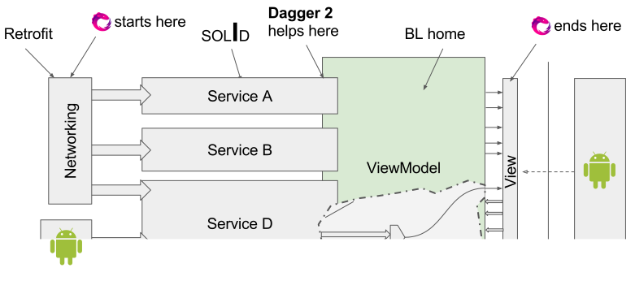

# Android production development with Kotlin
> Igor Korotenko, JunoLab

<!--
Hello! My name is Igor Korotenko, I'm Android engineer at Juno for last 2 years, one of those persons who decided to give Kotlin a try in codebase.
-->

<!--
More use-cases with actual code pieces!
-->


---------------------------------------------------------------
# Juno Rider android app.

* Full-`Kotlin`(started on **M11**) + `RxJava` from the start.
* 2 years.
* Kotlin 1.2 M1 in production. (and we are ~OK with **M***)
* 99.9% crash-free
* 6 developers, 2 QA

<!--
I'm here for you, guys, this slides are just a vector for what can we talk about, but don't be afraid to stop me at any moment and say "Just show us code and fun things!"
-->

___


# Juno Rider android app.

* `cloc main/kotlin` - **40K**
* `cloc test/kotlin` - **35K**
* `cloc androidTest/kotlin` - **10k**

<!--
Nowadays we have pretty big codebase fully written in Kotlin. This is without library projects we have, that we share with Driver team and open-source projects.
-->

---


# Why Kotlin?
1. Mostry because of Java.
   - No Java 8, 9 for Android. (at least 2 years ago)
   - It's very exhaustive, too many words to write from day to day!
   - Too many ways to shoot your leg.
2. Safer by default than Java.
3. It's utilizes modern programming concepts.
3. Just beatiful... 😍


---------------------------------------------------------------


# Core ideas

* Safety
	* Immutability
	* Easy concurrency
* Concide code
* Modularity
* Test-ready


---------------------------------------------------------------
# Immutability

## Reference immutability

```kotlin
val a = "Immutable Reference to String"
a = "Some other string" 
👆 Compile time error!

var b = "Mutable reference to String"
b = "Another string" 
👆 Works just fine!
```


---


## Objects immutability. Data classes

```kotlin
data class Person(
    val name: String,
    val age: Int
)

fun doSomething() {
    val john = Person("John", 20)
    val elderJohn = john.copy(age = 21)
}
```
<!--
Talking on immutability transitivity - immutable reference, all properties of object also immutable
-->


---


## Collections immutability

```kotlin
val list = listOf(1, 2, 3)
list.add(4)
```
<small>👆 Compile error!</small>

```kotlin
val mutableList = mutableListOf(1, 2, 3)
mutableList.add(4)
```
<small>👆 Fine!</small>


---------------------------------------------------------------
# Safety

- Immutability by default
- Classes & methods are `final` by default
- Nested classes don’t hold a reference to the outer
- Null safety
- ...


<!--
Thise and other aspects of safety are in each part of Kotlin design.
As an example here is few words about null-safety in Kotlin...
-->


---
## Null safety

```kotlin
val nullableString: String? 
    = if (Math.randon() > 0.5) "Yeah" else null

val length = nullableString.length
                           👆 Compile time error.

val nullableLength: Int? = nullableString?.length
                       👆 Nullability goes through.

val length2 = nullableString!!.length // The Java way.

```

<!--
Guaranteed at compile time -> no NPE in production ever. 
-->


---------------------------------------------------------------
# Concise code → expressive code.

* Type inference
* Data classes
* Sealed classes
* Smart casts
* Stream-like API
* Lambdas

<small>

> Conciseness of code is not something abstract, it's a thing that makes our day-to-day work easier. It saves our cognitive resources.  @me

</small>


---
## Stream-like API

```kotlin
val triple = { x: Int -> x*3 }
fun isGreaterThan5(x: Int) = x > 5

listOf(1, 2, 3)
    .map(triple)
    .filter(::isGreaterThan5)
    .forEach {
    	println("Survived: $it")
    }
```

 
>Much easier to understand complex reactive data-flow.

<!--
Code sample on complex Rx stream.
-->


---------------------------------------------------------------
# High level view on architecture

<br>





---------------------------------------------------------------
# Interop

> Will my favorite library work?


---
# Rule of 👍

* No black magic → works just fine
* Black magic → most probably works fine, but *need to re-check*


---
# Dagger2 

<br>

Initially DI code was in Java
Now, with `kapt`, DI can also be in Kotlin

<br>

<small>Even incremental `kapt` is a thing now.</small>

<!-- DataModule and ObjectGraph live code. -->


---
# Retrofit

<br>

>Works just fine! ☀️

<!-- CustomerApi live code. -->


---
# RxJava  

Works even better than Java + RxJava:

* <big> ƛ </big> Lambdas (non-capturing) 
* Extension functions

<!-- 
Complex stream sample. 
-->


---
# Gson

```kotlin
data class Model(

    @SerializedName("number_field")
    val number: Int 
    
)

model.number.toString() // Crash!
```

Gson uses **reflection** to set field values. 
> → is happy to set `null` into non-nullable field. **Beware!**


---
# Gson

Fail fast 💥
```kotlin
data class Model( 

    @SerializedName("number_field")
    private val _number: Int? 
    
) {

    val number: Int get() = _number!!

}

```

> 💡 Take a look at **`Moshi`**. Uses native kotlin reflection.


---
# Mockito 


1. Everything is `final` by default in Kotlin

	* **Dirty:** PowerMock.
	* **Clean:** Clean architecture. 
	
2. Mockito returns nulls where Koltin expects non-nullable

	* Use `Mockito-Kotlin` library
	* Write your own matchers


---------------------------------------------------------------
# Commons building blocks

<!--
During development we creating a lot of things and concepts that becomes widely used patterns in some time. We using sealed classes heavily. That's a really beautifull concept which allows easily work with state of model. 

-->


---
# Advanced type safety.
More checks are guaranteed at `compile time`

<!--
WHY? Runtime checks goes to compile-time
-->


---
# Type safety. Sum type.

```kotlin
sealed class Eta {
    data class Value(val value: Duration) : Eta()
    object Unknown : Eta()
    object NoService: Eta()
}

fun setEta(eta: Eta) {
    when (eta) {               🍰 Smart cast 👇                
        is Value -> setText("See you in ${time.seconds}")
        Unknown -> {
        	time.seconds 👈 Compile time error
            setText("--")
        }
        NoService -> // Inform user.
    }
}
```

`-1` transforms into `Eta.Unknown` → thus we never show `-1` to user.

<!--
Also bring your attention to smart cast here - one more point to Kotlin conciseness.
-->


---
# Type safety. Sum type. 
 Network responce

```kotlin
sealed class Data {
    class Value(val list: List<String>) : Data()
    sealed class Error {
    	object Expired : Error()
    	object Redeemed : Error()
    	object Unknown : Error()
    }
    
    ...
}
```

<!-- Code sample of how sealed cases created in stream -->


---------------------------------------------------------------
# Testing


### Main ideas

- Separation of concerns (clean architecture principles)
- Dependencies of SUT are interfaces
- Business logic is isolated from platform code
- UI layer can be replaced for tests


---
# 

<small>

```kotlin
describe("sign in screen") {

  context("initializing with valid email") {

      val env by memoized { Environment(EMAIL) }

      it("fills email") {
          verify(env.view.email.edit.text).call(EMAIL)
      }

      it("focuses on password") {
          verify(env.view.password.edit.focus).call()
      }

      it("shows password keyboard") {
          verify(env.view.password.edit.keyboardVisible).call(true)
      }
  }
  
  ...
```

> https://github.com/JetBrains/spek  We contributing a bit also.

</small>


---------------------------------------------------------------
# Challanges. Be aware with.

---
## Java

Beware of nulls that come from the Java’s dark side.
```kotlin
String! 

// string from Java (we dont know if its null or not)
```

💡 `@NotNull`, `@Nullable` in Java code helps!


---
## Method count

1. Kotlin - 6k
2. RxJava - 5k
3. `Multidex` works fine! ☀️


---
## Proguard

Nothing special about `Proguard`


---
## Destructuring

Actually usefull

```kotlin
val (first, second) = pair
val (first, second, third) = triple
Observable
    .fromCallable { createPair() }
    .subscribe { (first, second) ->
        println("1st is $first, 2nd is $second")
    }
```


---
## Destructuring

Supports `data class` and suggested by `IJ`
      
```kotlin
data class Person(
    firstName: String,
    lastName: String
)
val (firstName, lastName) = person
```


---
## Destructuring

Somebody swaps fields, compiler is happy!

```kotlin
data class Person(
    lastName: String,
    firstName: String
)
val (firstName, lastName) = person
```

**Solution:** We just banned in unless `Pair` or `Triple`. Unless you make separate types for `FirstName` & `LastName`. No joke here :)


---
# Assemble time ⌛️


* Coming from Java? +1 build step.
* Use Dagger? + 1 build  step.
* Compilation is CPU intensive.
* Laptops have mobile CPUs.


---
# Mainframer 

1. Laptop → **Source Code** → Buid Machine.
2. Build Machine → **Artifacts** → Laptop.

<br>
<br>

> https://github.com/gojuno/mainframer
> https://github.com/elpassion/mainframer-intellij-plugin


---
# Mainframer 

Clean build.

```kotlin
$ ./gradlew clean assembleDebug --no-daemon

# Locally  4m 10s
# On MF    1m 10s
```

Incremental build.

```kotlin
$ ./gradlew assembleDebug

# Locally  100s
# On MF    10s
```


---
# Hidden Costs <big>🔬</big>

## IJ → Tools → Show Kotlin Bytecode

> Lots of fun, also very insightfull and a bit scary.


---
# Open source

1. Mainframer
2. Koptional

!!!!! Add more info


---------------------------------------------------------------
# Questions?

<br><br><br><br>

<small>

>Contact info:

<small>

 http://facebook.com/igor.korotenko
 http://twitter.com/igor_korotenko
 http://github.com/igor-korotenko
</small>
</small>


---------------------------------------------------------------

<!--

- Why Kotlin?

	- Started from day-1, never regreted.

	- Nices things
		- Delegation
		- concisenes, лямбды (-> rxjava ok)
		- safety, immutability
		- conpile time checks
		- X? easy concurrency (rxjava)

	- Adaptaion
		- rxjava
		- dagger2 (kapt)

	- Which problems we met?
		- nullability & Gson (reflection)
		- Failing streams

- High level architecture
	- Stack (dependency graph)
	- What for?
	- Testability
	- Desigion making pronciple. 

- sealed classes in network responces
	- What problem solves.
	- How do we work with it?
    - Sample

- koptional
	- What problem solves.
	- Link to github

- MVVM
	- How do we cook it.
	- rx-binding -> rx-view
	- How do we test it (graph as VM dependency)

- DSL
	- Spek
	- UI tests

- Mainframer

- Bytecode for the win.

-->


                          
                     
  
